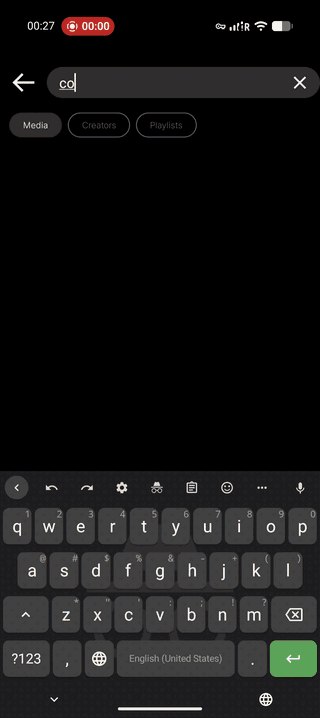
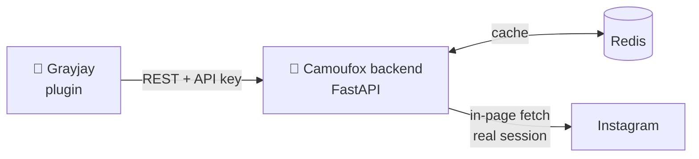
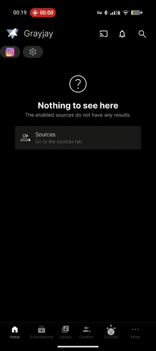

<div align="center">


# Instagram for Grayjay

**Your home feed, Reels, saved collections and comments — inside [Grayjay](https://grayjay.app).**
No Instagram credentials are ever entered into Grayjay itself.

[](https://grayjay.app)
[](docker-compose.yml)
[](https://camoufox.com)
[](LICENSE)



</div>

---

## How it works

A self-hosted backend drives a **real, logged-in
[Camoufox](https://camoufox.com)** (stealth Firefox). The browser profile *is*
the session, so the plugin never handles tokens.



Instagram aggressively flags the private mobile API; a real browser carries a
genuine session and fingerprint, and calls the same endpoints the web app does.

## Features

| | |
|---|---|
| **Home feed** | Your logged-in timeline. Videos only — photos and carousels are filtered out. |
| **Search** | Keyword **Reel** search, **creator** search, channel browse & subscribe. |
| **Reels** | Playback, comments, and **reply threads** on demand. |
| **Saved collections** | Appear in Grayjay's *Playlists* (plus "All saved reels") and play like any other. |
| **Import subscriptions** | Pulls the accounts you follow in as Grayjay subscriptions. |
| **Phone-only login** | Grayjay's **Login** button opens the backend's browser over noVNC — no laptop after deploying. |
| **Response cache** | Redis absorbs repeat requests: instant navigation, less traffic to Instagram. |
| **Request pacing** | Enforced spacing + jitter between Instagram calls, with backoff on rate-limits. |

Posting and following are out of scope.

## Preview

| Home feed | Saved collections | Login from the phone |
|:--:|:--:|:--:|
|  |  |  |

## Install

**1. Deploy.** Copy [`.env.example`](.env.example) to `.env`, fill it in, then:

```bash
docker compose up -d --build
```

Runs the backend (`:8000`), the noVNC login UI (`:6080`), Redis, and a plugin
server (`:8080`).

**2. Add the plugin.** Open `http://<host>:8080/` and scan the QR code.

<div align="center">

</div>

**3. Log in, once.** Tap **Login** on the source in Grayjay — its webview opens
the backend's browser and closes itself once the session lands — or use
`http://<host>:6080/vnc.html` from a computer. Serving starts automatically.

> Deploying on [Dokploy](https://dokploy.com) straight from git, signing the
> plugin, and every environment variable are covered in
> **[backend/server/README.md](backend/server/README.md)**.

## Settings

| Setting | What it does | Default |
|---|---|---|
| **Request spacing** | Minimum gap between real Instagram calls: `Fast 1s` / `Normal 2s` / `Careful 4s` / `Very careful 8s`. Can only ask the backend to go *slower* than its own floor. | Normal |
| **Cache duration** | How long the backend caches a response: `Off` / `1` / `3` / `5` / `10` min. | 3 min |
| **Load comment replies** | Fetch full reply threads on demand (one extra request each). Off = only the previews Instagram includes for free. | Off |

## Staying unflagged

It runs on **one** account, so the backend behaves like a person, not a scraper:

- **Pacing is server-side and jittered** — Instagram flags request *bursts*,
  not volume. A 429 or login wall triggers exponential backoff.
- **Pagers stop instead of spinning** — a page with no videos ends the pager
  instead of making Grayjay chase cursors forever.
- **GraphQL query ids self-heal** — Instagram retires them on every web
  release; the backend relearns them from the live page.

Seeing *"we suspect automated behaviour"*? Raise **Request spacing** and give
the account a day of ordinary use.

## Layout

```
plugin/          Grayjay plugin (InstagramConfig.json + InstagramScript.js)
backend/server/  Camoufox + FastAPI backend (app.py, browser.py, throttle.py, …)
backend/tests/   unit tests — no browser, network or Redis needed
docs/media/      screen recordings used above
```

Tests: `cd backend && PYTHONPATH=server python3 -m tests.test_throttle`
(also `test_docids`, `test_normalize`, `test_shortcode`) and
`node plugin/test_pagers.js`.

## Roadmap

**Importing** saved collections through Grayjay's *Import Playlists* (browsing
and searching them already works).
