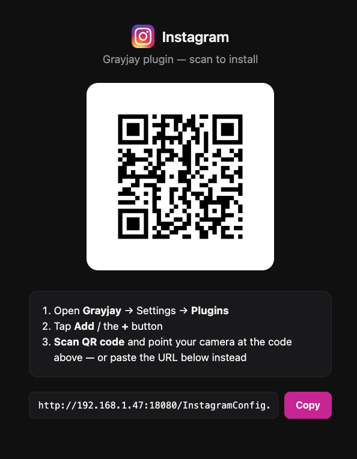

# Camoufox Instagram backend

A real-browser backend for the Grayjay Instagram plugin. It holds **one
long-lived, logged-in [Camoufox](https://camoufox.com)** page (stealth
Playwright-Firefox) and, for each request, runs an in-page `fetch()` against
Instagram's `/api/v1` endpoints — so calls carry a genuine session, cookies,
and fingerprint. The **browser profile is the session** (no tokens).
Serves on **:8000**.

```
plugin ──:8000──> FastAPI ──> one logged-in Camoufox page
                              └─ page.evaluate(fetch('/api/v1/...')) ──> Instagram
```

## Files
| File | Role |
|---|---|
| `app.py` | FastAPI routes (`/health`, `/search/users`, `/search/reels`, `/user`, `/feed`, `/saved/collections`, `/saved/reels`, `/user/reels`, `/media`, `/media/comments`, `/media/comments/replies`) + the auth + response-cache middleware |
| `browser.py` | Camoufox manager + `ig_fetch()` (in-page fetch) + serialization lock + integrated login detection + self-heal on crash |
| `cache.py` | best-effort Redis response cache (see **Caching**) — key builder + safe get/set that never breaks a request |
| `normalize.py` | Instagram JSON → the shapes the plugin reads |
| `utils.py` | shared stateless helpers (incl. reel shortcode → media pk codec) |
| `fingerprint.py` | pins one real Camoufox fingerprint preset (persisted in the profile) so login + serving + restarts share the same identity |
| `serve-vnc.sh` | container entrypoint — starts the virtual display + noVNC, then the API (see **Login** below) |
| `Dockerfile` | the backend image (xvfb + Firefox). The stack's `docker-compose.yml` lives at the **repo root** |

Tests live in **`backend/tests/`** (a sibling of `server/`) — run them from
`backend/` with `PYTHONPATH=server`: `test_normalize.py` / `test_shortcode.py`
(unit tests, no browser needed).

## Setup

> **TL;DR:** set the `.env` (step 1) → `docker compose up -d --build`
> (step 2) → open `http://<host>:6080/vnc.html` and log in once (see **Login**).

### 1. Configure (.env)
The compose stack lives at the **repo root** — run these steps from there.
Both services read a `.env` at the root (gitignored). For a public deployment:
```bash
cd <repo root>
cat > .env <<'EOF'
IG_API_KEY=<paste: openssl rand -hex 32>            # shared secret (auth)
IG_API_BASE=https://ig.example.com                  # PUBLIC backend URL
IG_SOURCE_URL=https://ig.example.com/InstagramConfig.json
EOF
```
- `IG_API_KEY` — the backend rejects any request (except `/health`) without a
  matching `X-API-Key`; the plugin sends it. **Unset = open mode** (private LAN
  only; the server logs a warning). 
- `IG_API_BASE` / `IG_SOURCE_URL` — the **public** URLs the plugin (running in
  Grayjay, not in Docker) uses to reach the backend / fetch updates. Defaults
  suit same-host local testing; set them to your LAN IP or VPS domain.

### 2. Run everything (one command)
```bash
docker compose up -d --build        # from the repo root
```
This starts **three** services:
- `ig-camoufox` — the backend on **:8000**, plus the **noVNC login UI** on
  **:6080** (build context `./backend/server`).
- `ig-plugin` — builds `./plugin`, runs `configure.py` (bakes the `.env` values
  into the plugin, incl. `allowUrls`) and http-serves it on **:8080**, incl. a
  QR install page.
- `redis` — the response cache (internal only; see **Caching** below).

Open `http://<host>:8080/` and **scan the QR code** in Grayjay (Settings →
Plugins → Add → Scan QR code) — or install directly from
`http://<host>:8080/InstagramConfig.json`.



```bash
curl http://localhost:8000/health
# {"status":"ok","ready":false,"needs_login":true}  -> log in (below)
```

## Login (integrated, no shell / no TTY)

The backend runs **one headful Camoufox** on a virtual display and serves it
over **noVNC**. On first run the profile has no session, so the browser sits on
the Instagram login page and `/health` reports `needs_login:true`. Just:

1. Open **`http://<host>:6080/vnc.html`** in any browser and click **Connect**.
2. Log in fully (email / 2FA) until you see your feed.
3. Done — the backend **auto-detects** the session (polls for the `sessionid`
   cookie), navigates home, and starts serving. `/health` flips to
   `ready:true`. Nothing to press; the **same** browser now serves requests.

The session + the pinned fingerprint are written into the **named Docker
volume** `ig-profile` (declared in `docker-compose.yml`), so they survive
container restarts, rebuilds, **and redeploys** - it's owned by Docker, not
the git checkout, so tools that `rm -rf` and re-clone the repo on every
deploy (Dokploy included) don't touch it. To **re-login** later (session
expired), open the same noVNC URL and log in again — the backend notices and
resumes. No profile transfer, no `docker compose run`, no ENTER.

> Only `docker compose down -v` (the `-v`) or `docker volume rm` deletes this
> volume - a plain redeploy or `down`/`up` never does. To force a fresh login,
> remove it deliberately: `docker compose down && docker volume rm
> <project>_ig-profile` (find the exact name with `docker volume ls`).

> **Protect :6080** — whoever opens it can drive your logged-in Instagram. Set
> `VNC_PASS` (adds a noVNC password) and/or firewall the port to your IP. On a
> public host also front it (and :8000) with HTTPS so the VNC stream and the API
> key aren't in clear text.

### Deploy on Dokploy (UI-only, from git)
1. **New → Compose**, point it at this repo; **Compose Path** = `docker-compose.yml` (repo root).
2. In **Environment**, set `IG_API_KEY`, `IG_API_BASE`, `IG_SOURCE_URL`,
   `VNC_PASS`, and — if `8000/8080/6080` are already used on the box — custom
   **host** ports `IG_API_PORT` / `IG_PLUGIN_PORT` / `IG_VNC_PORT`. Point
   `IG_API_BASE` / `IG_SOURCE_URL` at those same ports, e.g.:
   ```
   IG_API_PORT=18000
   IG_PLUGIN_PORT=18080
   IG_VNC_PORT=16080
   IG_API_BASE=http://<server-ip>:18000
   IG_SOURCE_URL=http://<server-ip>:18080/InstagramConfig.json
   ```
   (Only the host side moves; the containers still listen on 8000/8080/6080.)
3. **Deploy.** Dokploy runs `docker compose up -d --build` — no manual commands.
4. Open **`http://<server-ip>:<IG_VNC_PORT>/vnc.html`** and log in once (step
   above). The backend serves automatically; open `http://<server-ip>:<IG_PLUGIN_PORT>/`
   and scan the QR code in Grayjay to install.

Redeploys (git push → Redeploy) reuse the `ig-profile` volume, so you stay
logged in.

> **Cleaner alternative on a busy box:** skip host ports entirely and give each
> service a **domain** in Dokploy (Traefik routes by hostname, adds HTTPS, no
> port clashes). Add a basic-auth middleware to the noVNC one. Then the `*_PORT`
> vars don't matter — Traefik reaches the containers over the compose network.

## Signing the plugin (optional)

Without a signature, Grayjay installs the plugin fine but shows a **missing
signature** notice, since it can't verify who published it. Fixing that means
giving the plugin container an RSA private key at build time — the `plugin`
service signs the *actual deployed* script with it every time it starts
(RSA-SHA512, the same scheme as Grayjay's own `scriptSignature` /
`scriptPublicKey` fields), so signing has to happen after `IG_API_BASE`/
`IG_API_KEY` are baked in, not once in the repo. Generate a key once (any
RSA key works — a fresh one or an existing `~/.ssh/id_rsa`; both the
traditional PEM and modern OpenSSH private-key formats are supported):

```bash
ssh-keygen -t rsa -b 4096 -f ~/.ssh/id_rsa_grayjay -N ""   # keep the private key
```

Then give it to the container **either** way (only one is needed):

- **As an env var (`IG_SIGN_KEY_B64`)** — no volume mount, so it works from a
  UI-only host like Dokploy with no shell/file access:
  ```bash
  base64 -w0 ~/.ssh/id_rsa_grayjay          # Linux
  base64 -i ~/.ssh/id_rsa_grayjay | tr -d '\n'   # macOS (no -w flag)
  ```
  Paste the single-line output as `IG_SIGN_KEY_B64` in `.env` (or Dokploy's
  Environment box). Base64 avoids every multi-line-value pitfall (`.env`
  parsing, UI textareas, YAML, shell quoting all choke on a raw multi-line PEM).
- **As a mounted file (`IG_SIGN_KEY_PATH`)** — if you do have host/file
  access: uncomment the `volumes:` line under the `plugin` service in
  `docker-compose.yml` (mounts the key **read-only**), then set
  `IG_SIGN_KEY_PATH=/keys/id_rsa` in `.env` (the **in-container** path from
  that mount, not a path on your host).

Either way, rebuild (`docker compose up -d --build`). The private key never
leaves your server and isn't baked into the image; only set one of these if
you want the notice gone. Re-installing after re-signing (e.g. you rotated
the key) requires removing and re-adding the plugin in Grayjay, since it pins
the public key it first saw.

## Caching

The `redis` service caches successful responses so Grayjay's constant repeat
requests (flipping pages, re-opening a channel, re-running a search) are served
instantly instead of driving the browser again — smoother navigation and far
less Instagram rate-limiting.

- **Duration is set in the plugin**, not here: the **"Cache duration"** setting
  in Grayjay (Off / 1 / 3 / 5 / 10 min, default 3) is sent per request as an
  `X-Cache-TTL` header; the backend caches that response for that long. `Off`
  sends no header and nothing is cached.
- Only `200` JSON is cached (keyed by method + path + query, so each page /
  cursor is separate); errors and login walls never are.
- `CACHE_MAX_TTL` (default 600s) caps whatever the plugin asks for.
- **Fail-safe**: if Redis is down the backend just serves uncached — it never
  errors or slows down, and caching resumes on its own when Redis returns.
- Redis is internal (no published port), memory-capped (128 MB, LRU) and
  disposable (no volume) — it's only a cache.

Check it: responses carry an `X-Cache: HIT|MISS` header;
`docker exec ig-redis redis-cli keys 'igcache*'` lists cached entries.

## Notes / limits
- **Heavy/slow**: a browser is hundreds of MB and seconds per call; requests
  are serialized (one page, one lock). Repeat requests are absorbed by the
  Redis cache (above).
- **Single account**: rapid browsing of many creators' reels can temporarily
  rate-limit the `clips` endpoint (login wall); it recovers on its own.
- **Pinned fingerprint**: the first login captures one real Camoufox
  fingerprint preset and saves it to `camoufox-fingerprint.json` **inside the
  profile dir**; login, serving, and every restart replay that exact
  fingerprint (via `fingerprint.py`), so Instagram sees a stable identity. The
  UA is part of that preset (auto-matched to the pinned Firefox build) — no
  separate UA to keep in sync. Delete the file to re-roll (requires a new
  login); `CAMOUFOX_FP_OS` (default `macos`) sets the OS family on first roll.
- **Self-healing**: if the browser/page transport dies, the next request
  relaunches Camoufox and retries once — a crash recovers instead of wedging.
- **`ig-profile` (Docker volume) holds your session and fingerprint.** Not a
  git-tracked path, so there's nothing to accidentally commit. To inspect or
  back it up: `docker run --rm -v <project>_ig-profile:/data -v "$PWD":/backup
  busybox tar czf /backup/ig-profile.tar.gz -C /data .`
